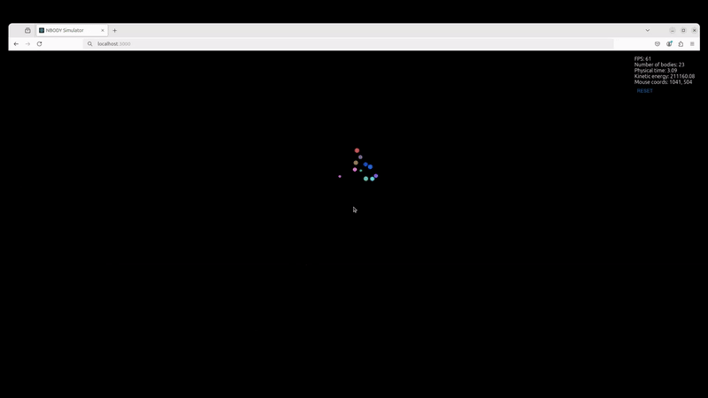

# 2D N-Body Simulator

A weekend 2D N-body simulation project designed to simulate and visualize the interactions between multiple particles under the influence of gravity.
This project explores the following topics:
- Explore socket communication and event-driven architecture
- Utilize web-assembly to facilitate client-server communication
- Further integrate the backend code into the client and remove the server dependency.

## Features

- **Frontend**: Built with React + TypeScript for an intuitive and interactive user interface.
- **Backend**: Powered by Rust for high-performance computation and scalability.
- **WebSocket Communication**: Real-time communication between the frontend and backend for smooth simulations.
- **WebAssembly (WASM)**:
  - Shared types between the frontend and backend to maintain consistency.
  - Simulation engine can run directly in the browser using WASM for a seamless, serverless experience.
- **Flexible Deployment**:
  - Connect to a remote server for backend processing.
  - Run the simulation entirely in the browser for client-side computation.

## Demo



## Getting Started

### Prerequisites

- **Node.js** and **npm**
- **Rust** (with wasm-pack for building the WASM module).

### Usage
- WASM Simulation: Switch to using the WASM-based simulation engine directly in the browser for a lightweight, self-contained experience.
- Simulation Over Socket: Extract more performance from splitting the workload between the frontend and the backend with a typical client-server architecture

## Building the Code

### With Docker
To simplify the setup process, you can build and run the project using Docker.

1. Clone the repository:
   ```bash
   git clone https://github.com/DGPardo/simulation-over-web-socket.git
   cd 2d-nbody-simulator

2. Build the docker images
    ```bash
    docker compose build

3. Create and run the containers
    ```bash
    docker compose up

Then navigate to `http://localhost:3000`

### From Source

1. Clone the repository:

bash
   git clone https://github.com/DGPardo/simulation-over-web-socket.git
   cd 2d-nbody-simulator

2. Build the backend
    cd backend
    cargo build --release

3. Build the WASM module
    cd backend/wasm-bindings
    wasm-pack build --target web

3. Run the backend
    cd backend
    cargo run --release

4. Run the client
    cd frontend
    npm start


## Project Structure

The repository is organized into the following directories:

- **`frontend/`**
  Contains the React + TypeScript frontend code, responsible for the user interface and browser-based simulation.

- **`backend/`**
  Includes the Rust backend code, which powers the high-performance simulation engine and WebSocket server for remote computations.

- **`backend/wasm-bindings/`**
  Hosts the WebAssembly (WASM) module, used for:
  - Sharing types between the frontend and backend.
  - Running the simulation engine directly in the browser for client-side computations.
